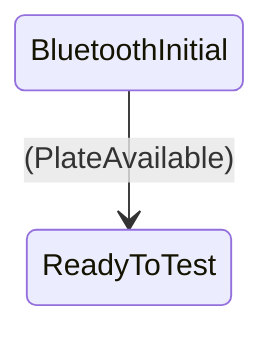

1. Check that Bluetooth is available and turn it on, put into an error state if it is not, put into a ready state if it is
2. The ready state should listen for user input to initiate a scan, start the scan, and put the app into a scanning state
3. the scanning state should listen for scan results, when the scan results come back it should put the bloc into the scan results available state
4. the scan result available state should listen for additional scan results and update if they have change, it should also listen for the connect event from the user if they have found the device the want to connect to, make the connection call, and put the bloc into the connecting state
5. the connecting state should wait for the connection to complete, put the bloc into the connected state if its successful, and put the bloc into the connection error state if not.
6. the connected state should call the native plugin and display the IP address of the device and the UDP port.
7.
